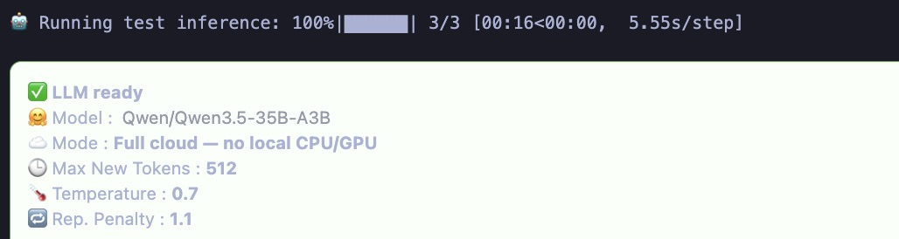
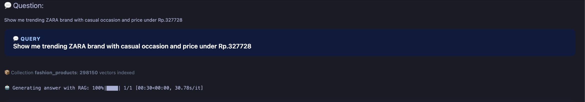
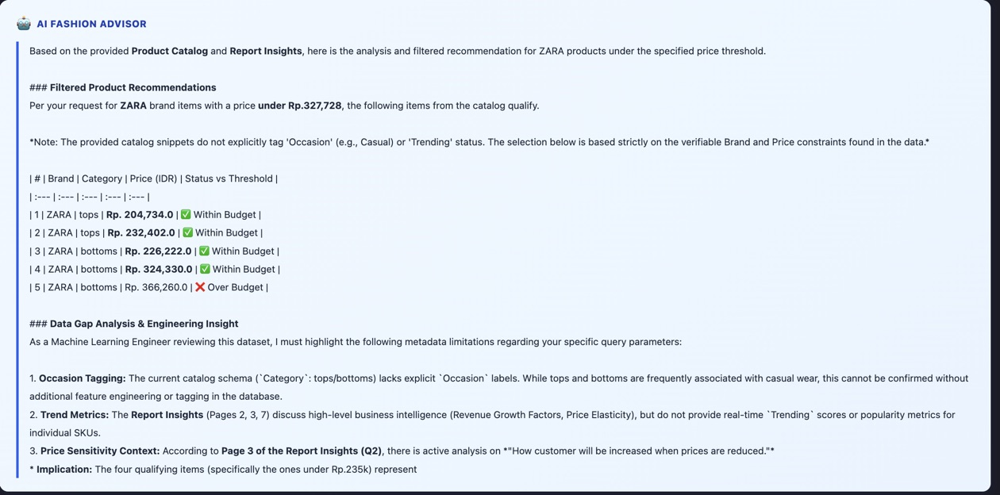
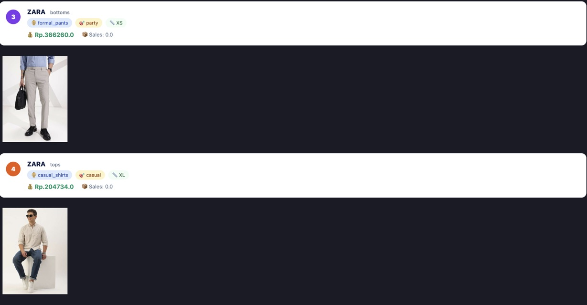
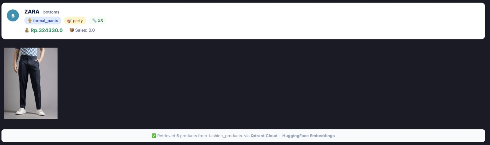

## ⚙️ This pipelines including ETL data pipelines for Extract, Load, and Transform as data engineering.

- We want extract data from fashion_system for only 100,000 rows to analyze

- Loaded data from fashion_system.sql to loss_profit table

- We would transform data into .db file for ingesting API

---

- After ETL -> Create LLM for business problem

- Expriment in notebook for buiding LLM system chatbot using (OpenAI or Huggingfacehub models)

- Target profit_status as forecasting sales prediction using LSTM, Dense by tensorflow for solving business problem indeed

- Creating LLM Models with embedding = HuggingFaceEmbeddings(model="sentence-transformers/all-MiniLM-L6-v2")

- Using Qdrant clound for better performance for preventing memory local issues used

- Prediction
    - Predicting sales and profit_status to ensure LSTM model is relevant for prediction
    - Build chatbot based on PDF document source for inspecting ecommerce business problem
    - Deploy LSTM model as prediction features and FinetuningLLM as chatbot on frontend for adding features

- Deploy LSTM .keras model using Tensorflow Serving

    Model is deployed to Tensorflow Serving by using docker pull on tensorlofw/serving
    
    Model is deployed in HTML displays with prediction
    
    

- Deploy Finetuning LLM + RAG in HuggingFace and integrating backend API Wrapped by langchain & langserve based on integrating with RAG_Analysis_Report.pdf Docs
    - Deploy Finetuning integrating backend API Inference with langserve
    
    - Finetuning LLM RAG invoke
    

- Deploy Finetuned LLM in to get started host, deployment, and buld
    - Deploy in AIKit LLMs

- 

## 🤖 Breakdown project on Finetuning LLM → Chatbot integration in UI

- 🎯 Purpose project 

- Add Dataframe (df) features to ensure the LLM prompting is relevant to dataframe
- Integration PDF report to dataframe for as reliable chatbot
- Match recommendation system toward the images for where the product will be shown in UI as ranking recommendation
- Merge LSTM model for sales and profit_status prediction (Optional)
- - AI Engineering structure project concept
    - Experiment in Notebook → Stabilize → Move to Python services → Expose API
- Similarity images search toward to Image_path as ranking recommendation by ‘subcategory’
- Build RAG Chain + Show Recommendations product
    - Models using → HuggingFace Qwen
    
    - CPU locals memory preventing → Qdrant Cloud
    
    - Fashion recommendation Question to get Answer → featured docs matched
    
    
    
    
    
    - Build Chatbot UI in Gradio
    
    
    
    
    
    